# nestedPlot

Install nestedPlot

```r
devtools::install_github("siddharthapachhai/nestedPlot")
```


```r
library(nestedPlot)
```

# 1 Sample Diamonds Data Set

In this example we are going to use nested plot to investigate the `sample_diamonds` dataset. The `sample_diamonds` dataset is a sampled version of the `ggplot2` library. For this example I am investivating how the relationship between the variable `x` and `price` of diamonds differ across different groups `cut` and category `color`.


## 1.1 Individual Events

First lets look at a simple model to represent the relationship between price and x. In terms of supplying parameters to the function, you can see that we have to mention `iscat = F` inorder to plot continuous y response. As we are also declaring v3 which is the grouping or faceting variable as NULL and obs.y the coloring variable as NULL, we can thus create a plot that shows the simplest interaction between two variables.


```r
nestedPlot(df = sample_diamonds, v1 = "x", v2 = "price",v3 = NULL,obs.y = NULL,iscat=F, jW =0 , jH = 0)
[[1]]
```

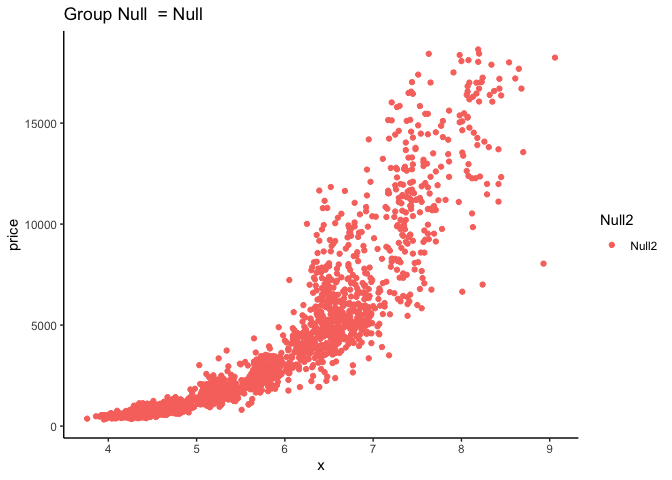<!-- -->
&nbsp;
&nbsp;


Now next lets add a coloring variable i.e `obs.y = "color"`.
&nbsp;
&nbsp;


```r
nestedPlot(df = sample_diamonds, v1 = "x", v2 = "price",v3 = NULL,obs.y = "color",iscat=F, freqz = T , jW =0 , jH = 0)
[[1]]
```

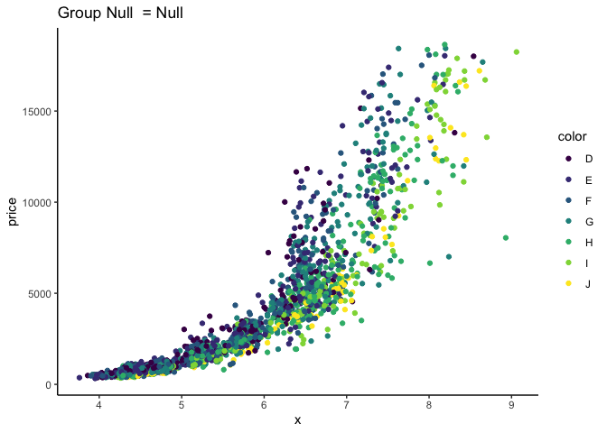<!-- -->
&nbsp;
&nbsp;

We can speculate that "color" effects the price, we can also add `plot.Trend = T`. Doing so we can fit smooth lines to identify trends that exist in each of the coloring groups.

&nbsp;
&nbsp;


```r
nestedPlot(df = sample_diamonds, v1 = "x", v2 = "price",v3 = NULL,obs.y = "color",iscat=F, freqz = T , plot.Trend = T)
[[1]]
```

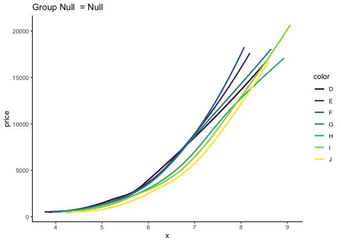<!-- -->
&nbsp;
&nbsp;


It already seems there is effect caused by the various coloring groups. Now lets look at how price and x vary in each of the facet groups. Lets add `v3 = "cut"`.

&nbsp;
&nbsp;


```r
StitchNest( 
  nestedPlot(df = sample_diamonds, v1 = "x", v2 = "price",v3 = "cut",obs.y = NULL,iscat=F, plot.Trend = T)
  )
```

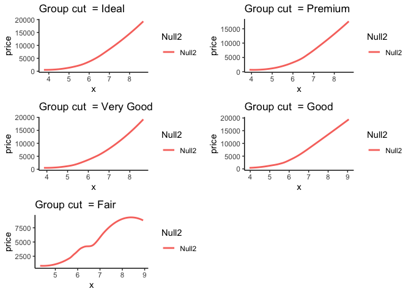<!-- -->
&nbsp;
&nbsp;


It also seems that prices vary with respect to x for each group in cut.

&nbsp;
&nbsp;

## 1.2 Multi Factor Models

&nbsp;
&nbsp;

Next lets look at how including both grouping variables can help reveal new trends.
&nbsp;
&nbsp;


```r
StitchNest( 
  nestedPlot(df = sample_diamonds, v1 = "x", v2 = "price",v3 = "cut",obs.y = "color",iscat=F, freqz = T , jW =0 , jH = 0)
  )
```

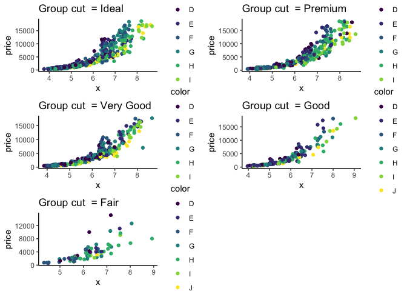<!-- -->
&nbsp;
&nbsp;

Lets fit a smooth line next.
&nbsp;
&nbsp;


```r
StitchNest( 
  nestedPlot(df = sample_diamonds, v1 = "x", v2 = "price",v3 = "cut",obs.y = "color",iscat=F, freqz = T , jW =0 , jH = 0,
             plot.Trend = T)
  )
```

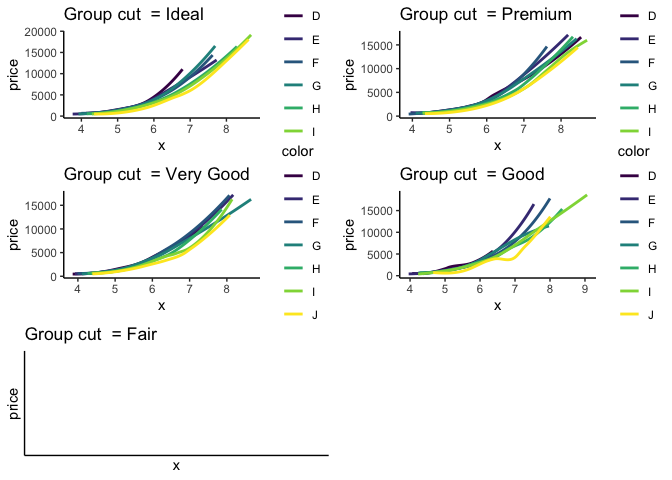<!-- -->
&nbsp;
&nbsp;

It seems like one of the groups didn't covnerge. So lets change method to `method = "lm"`.

&nbsp;
&nbsp;


```r
StitchNest( 
  nestedPlot(df = sample_diamonds, v1 = "x", v2 = "price",v3 = "cut",obs.y = "color",iscat=F, freqz = T , jW =0 , jH = 0,
             plot.Trend = T, method = 'lm')
  )
```

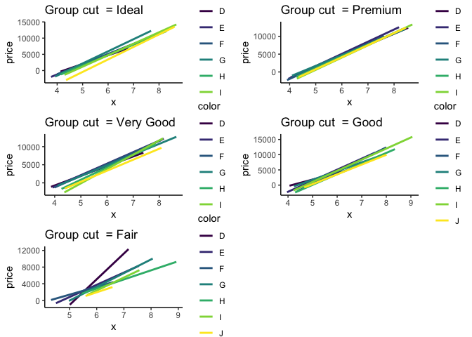<!-- -->
&nbsp;
&nbsp;

The trend seems more visible, but lets transform the data to reveal better trends.

&nbsp;
&nbsp;


```r

diamonds_t = sample_diamonds
diamonds_t$l_price = log(diamonds_t$price)

StitchNest( 
  nestedPlot(df = diamonds_t, v1 = "x", v2 = "l_price",v3 = "cut",obs.y = "color",iscat=F, freqz = T , jW =0 , jH = 0)
  )
```

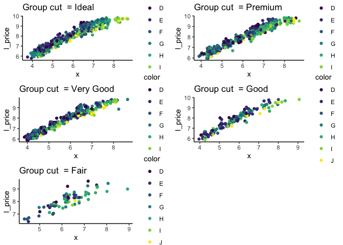<!-- -->
&nbsp;
&nbsp;


```r

diamonds_t = sample_diamonds
diamonds_t$l_price = log(diamonds_t$price)

StitchNest( 
  nestedPlot(df = diamonds_t, v1 = "x", v2 = "l_price",v3 = "cut",obs.y = "color",iscat=F, freqz = T , jW =0 , jH = 0, plot.Trend = T, method = 'glm')
  )
```

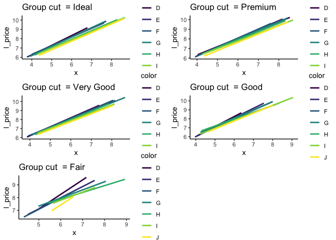<!-- -->

&nbsp;
&nbsp;


Looking at the plots we can conclude that color explains more about the variance observed than the faceting group cut. 

&nbsp;
&nbsp;


```r
anova(lm(l_price~x+color+cut,diamonds_t))
Analysis of Variance Table

Response: l_price
            Df  Sum Sq Mean Sq   F value    Pr(>F)    
x            1 1920.25 1920.25 32603.699 < 2.2e-16 ***
color        6   27.13    4.52    76.778 < 2.2e-16 ***
cut          4    6.09    1.52    25.839 < 2.2e-16 ***
Residuals 1988  117.09    0.06                        
---
Signif. codes:  0 '***' 0.001 '**' 0.01 '*' 0.05 '.' 0.1 ' ' 1
```

&nbsp;
&nbsp;


# 2 Chicken Weights Data

In this example we are interested in finding out which diet group was the most effective in increasing weights of chicks. Looking at all factors it seems there deffinitely is a effect caused by diet.


```r
StitchNest( 
  nestedPlot(df = ChickWeight, v1 = "Time", v2 = "weight",v3 = "Diet",obs.y = "Chick",iscat=F, freqz = T , jW =0 , jH = 0)
  )
```

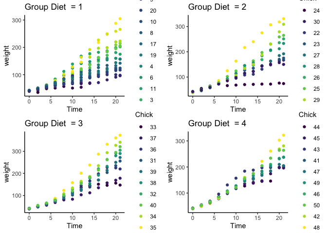<!-- -->

&nbsp;
&nbsp;


Lets see how the weights varry in specific time points. *Note: We have to reduce the jitter ie* `jW = 0` and `jH = 0`. 

&nbsp;
&nbsp;


```r
StitchNest( 
  nestedPlot(df = ChickWeight[ChickWeight$Time %in% c(0,8,14,21),], 
             v1 = "Diet", v2 = "weight",v3 = "Time",obs.y = NULL,iscat=F, freqz = T , jW =0.0 , jH = 0.0)
  )
```

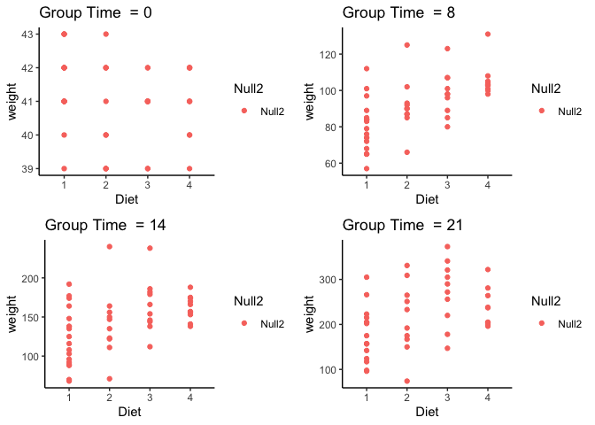<!-- -->

&nbsp;
&nbsp;

We can already see an interesting trend occuring. Now lets do what most investigators do and see what treatment had the most effect on weight compared to baseline of time = 0. This requires some data wranginling. 

&nbsp;
&nbsp;


```r
end_study = ChickWeight[ChickWeight$Time == 21,] 
baseline = ChickWeight[(ChickWeight$Time == 0) & (ChickWeight$Chick %in% end_study$Chick),] 
end_study$Chick = as.numeric(end_study$Chick) 
baseline$Chick = as.numeric(baseline$Chick) 
end_study <-end_study[order(end_study$Chick),]
baseline <-baseline[order(baseline$Chick),]
end_study$delta = end_study$weight - baseline$weight

nestedPlot(df = end_study, 
             v1 = "Diet", v2 = "delta",v3 = NULL,obs.y = NULL,iscat=F, freqz = T , jW =0.0 , jH = 0.0)
[[1]]
```

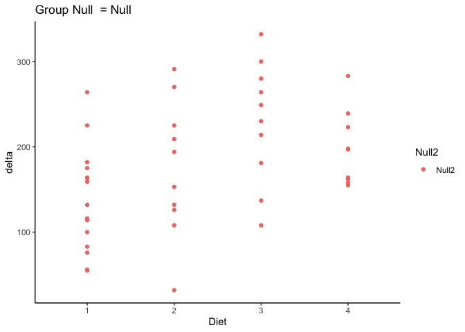<!-- -->

&nbsp;
&nbsp;

We can conclude that Diet group 3 & 4 are more effective than 1 & 2. Looking at the plots it also seemed like treatment 3 showed stronger linear association with weight then 4. We can look at one more plot for this.

&nbsp;
&nbsp;


```r
StitchNest( 
  nestedPlot(df = ChickWeight, v1 = "Time", v2 = "weight",v3 = NULL,obs.y = "Diet",iscat=F, freqz = T , jW =0 , jH = 0, plot.Trend = T, method = 'lm')
  )
```

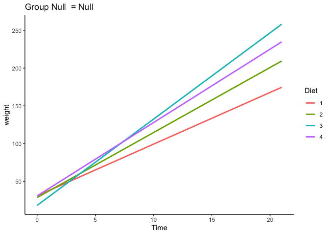<!-- -->

&nbsp;
&nbsp;

Tukey HSD

&nbsp;
&nbsp;


```r
plot(TukeyHSD(aov(delta~Diet ,data = end_study)))
```

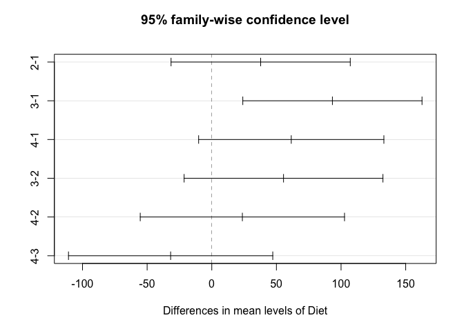<!-- -->
&nbsp;
&nbsp;

# 3 Lets analyse data with Binary respnse

&nbsp;
&nbsp;


```r
head(GOLF)
   Outlook Temp Humidity Windy Play.Golf
1    Rainy  Hot     High FALSE        No
2    Rainy  Hot     High  TRUE        No
3 Overcast  Hot     High FALSE       Yes
4    Sunny Mild     High FALSE       Yes
5    Sunny Cool   Normal FALSE       Yes
6    Sunny Cool   Normal  TRUE        No
```

&nbsp;
&nbsp;


```r
StitchNest( 
  nestedPlot(df = GOLF, v1 = "Outlook", v2 = "Play.Golf",v3 = "Temp",obs.y = "Windy",iscat=T, freqz = F , jW =0 , jH = 0),
  NCOL = 1
  )
```

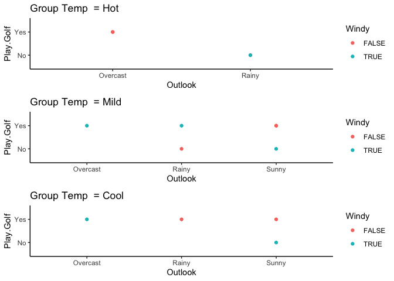<!-- -->

&nbsp;
&nbsp;

At first glance the plot does not seem to helpful, next lets add some jitter.

&nbsp;
&nbsp;


```r
StitchNest( 
  nestedPlot(df = GOLF, v1 = "Outlook", v2 = "Play.Golf",v3 = "Temp",obs.y = "Windy",iscat=T, freqz = F , jW =0.15 , jH = 0.15),
  NCOL = 2, NROW = 2
  )
```

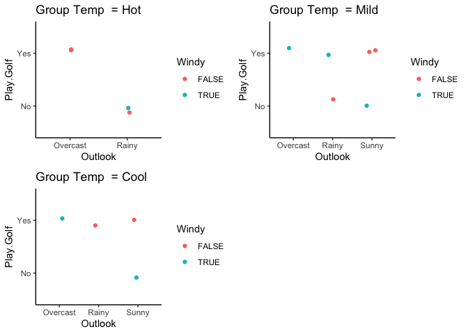<!-- -->

&nbsp;
&nbsp;

We can look at the respective frequencies

&nbsp;
&nbsp;


```r
StitchNest( 
  nestedPlot(df = GOLF, v1 = "Outlook", v2 = "Play.Golf",v3 = "Temp",obs.y = "Windy",iscat=T, freqz = T , pc = T),
  NCOL = 2, NROW = 2
  )
```

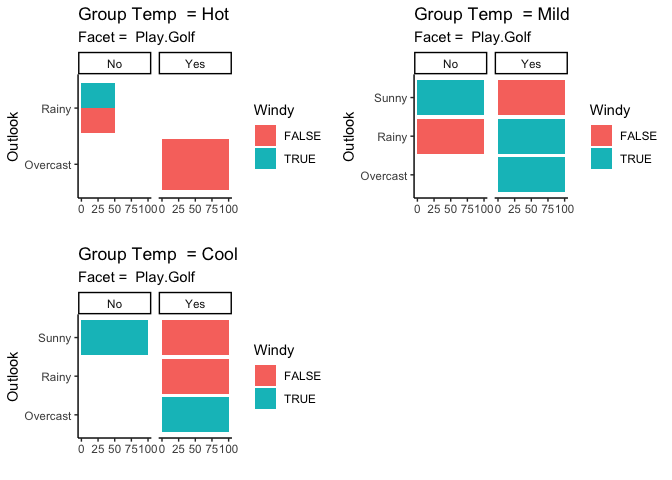<!-- -->

&nbsp;
&nbsp;

Based on the plots it is evident that all the factors provide much needed information to predict whether to play or not to play golf. It is often better to model such data using tree based model.


